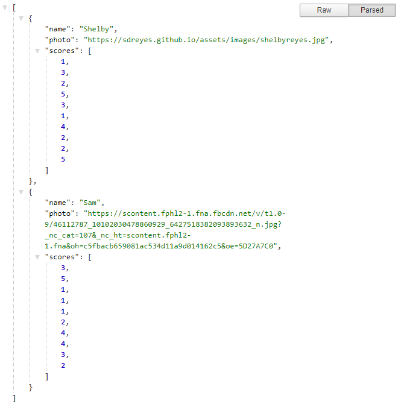
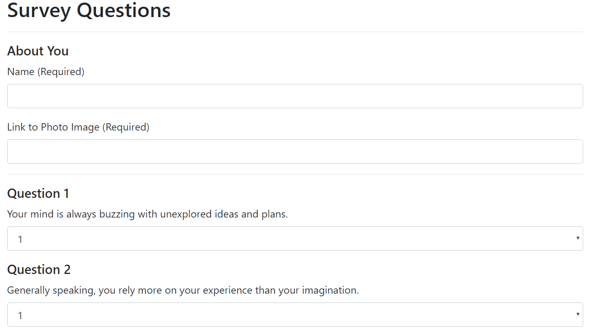

# Friend Finder
> Answer a few basic questions. Then find the friend with the greatest compatibility!

Friend Finder compares your survey answers to every other user that has taken the survey. It then returns a friend's name and photo with the answers most similar to yours!

## Getting started

From the homepage, you can either choose to take the survey or view the API response in JSON format. 

The API displays the answers from everyone who's taken the survey.

The user needs to input their name and photo link to recieve a response from the server. The server will send back information about a person whose score answers most closely matches the user's.

## About

This app uses Express.js in conjunction with Node.js to create a server that responds to get and post requests.

## Links

- Repository: https://github.com/sdreyes/FriendFinder
- Deployed: https://friend-finder-sdreyes.herokuapp.com/

## Author

- Shelby Reyes - Full Stack Web Developer: https://sdreyes.github.io/